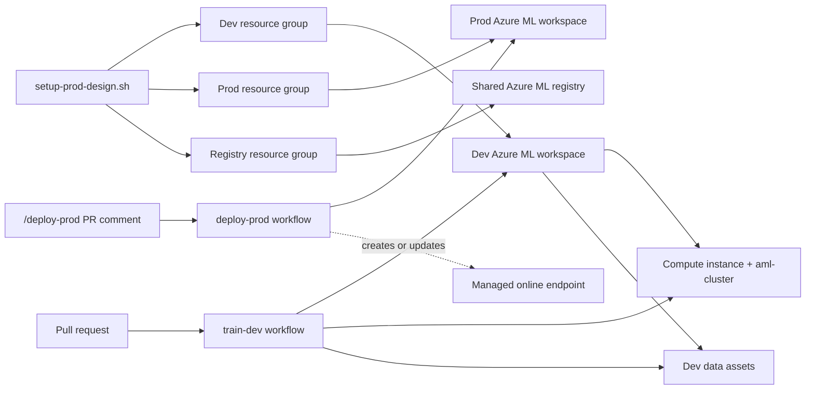

# Azure Machine Learning MLOps demo

This repository demonstrates a compact model lifecycle with Azure Machine Learning:

1. Provision isolated development and production environments.
2. Train and debug a Python model locally.
3. Validate code and model quality in CI.
4. Deploy the model to a managed online endpoint through a controlled CD command.

## Architecture



Development contains the training compute and data assets. Production contains no training cluster: the CD workflow provisions endpoint-managed serving compute when it creates or updates the online deployment.

## Repository structure

| Path | Purpose |
|---|---|
| [`infra/`](infra/) | Azure CLI provisioning scripts and the registry definition |
| [`src/train-model-parameters.py`](src/train-model-parameters.py) | Shared local and Azure ML training implementation |
| [`src/job.yml`](src/job.yml) | Azure ML training job definition |
| [`src/validate_metrics.py`](src/validate_metrics.py) | Model quality gate |
| [`src/deploy_to_online_endpoint.py`](src/deploy_to_online_endpoint.py) | Managed online endpoint deployment |
| [`model/`](model/) | MLflow model currently deployed by CD |
| [`tests/`](tests/) | Training, quality-gate, and endpoint smoke-test fixtures |
| [`.github/workflows/train-dev.yml`](.github/workflows/train-dev.yml) | Pull-request CI workflow |
| [`.github/workflows/deploy-prod.yml`](.github/workflows/deploy-prod.yml) | Comment-triggered production deployment |
| [`docs/`](docs/) | Supporting Azure ML lab documentation |

## Prerequisites

- Python 3.10
- [`uv`](https://docs.astral.sh/uv/) for the local environment commands below
- Azure CLI authenticated to the target subscription
- Azure Machine Learning CLI extension
- VS Code with the Python extension for the supplied debug configuration
- GitHub environments named `dev` and `prod`, each exposing an `AZURE_CREDENTIALS` secret with access to the corresponding Azure resources

Install the Azure ML extension and verify the active subscription:

```bash
az extension add --name ml --yes
az account show
```

## Provision the Azure foundation

Run the bootstrap from a Linux shell such as Azure Cloud Shell because its UUID generation currently reads `/proc/sys/kernel/random/uuid`. Paths in the script are relative to `infra/`.

```bash
cd infra
bash setup-prod-design.sh
```

The script generates one 18-character suffix and creates the following resource groups and Azure ML resources in a shared, randomly selected region:

| Environment | Resource group | Resources |
|---|---|---|
| Development | `rg-demo-dev-<suffix>` | `mlw-demo-dev-<suffix>`, a `STANDARD_E2DS_V5` compute instance, the autoscaling `aml-cluster`, and three data assets |
| Production | `rg-demo-prod-<suffix>` | `mlw-demo-prod-<suffix>` and `diabetes-prod-folder`; no training compute |
| Shared registry | `rg-demo-reg-<suffix>` | `mlr-demo-shrd-<suffix>`, rendered from `infra/registry.yml` |

The names form contracts with the workflows:

| Provisioned name | Consumer |
|---|---|
| `rg-demo-dev-*` and `mlw-demo-dev-*` | Development workspace discovery in `train-dev.yml` |
| `aml-cluster` | `compute: azureml:aml-cluster` in `src/job.yml` |
| `diabetes-dev-folder` | Training input override in the CI workflow |
| `rg-demo-prod-*` and `mlw-demo-prod-*` | Production workspace discovery in `deploy-prod.yml` |
| Production workspace suffix | Deterministic endpoint name `diabetes-live-<first-12-suffix-characters>` |
| `diabetes-prod-folder` | Reserved for future offline production evaluation |
| `mlr-demo-shrd-*` | Reserved for future model registration and promotion |

The bootstrap does not configure GitHub environments, credentials, federated identity, RBAC, or approval gates. It also does not create the online endpoint; the deployment workflow owns that resource.

The script is an imperative environment bootstrap, rather than idempotent Bicep or Terraform. Every execution creates a new suffix. Keep only one active resource group for each `rg-demo-dev-*`, `rg-demo-prod-*`, and `rg-demo-reg-*` prefix because the workflows currently select the first match.

### Inspect an existing environment

The following read-only commands resolve the same naming contracts used by the workflows:

```bash
DEV_RG=$(az group list --query "[?starts_with(name,'rg-demo-dev-')].name | [0]" -o tsv)
DEV_WS=$(az ml workspace list --resource-group "$DEV_RG" --query "[?starts_with(name,'mlw-demo-dev-')].name | [0]" -o tsv)
PROD_RG=$(az group list --query "[?starts_with(name,'rg-demo-prod-')].name | [0]" -o tsv)
PROD_WS=$(az ml workspace list --resource-group "$PROD_RG" --query "[?starts_with(name,'mlw-demo-prod-')].name | [0]" -o tsv)
REG_RG=$(az group list --query "[?starts_with(name,'rg-demo-reg-')].name | [0]" -o tsv)

az ml compute list --resource-group "$DEV_RG" --workspace-name "$DEV_WS" -o table
az ml data list --resource-group "$DEV_RG" --workspace-name "$DEV_WS" -o table
az ml compute list --resource-group "$PROD_RG" --workspace-name "$PROD_WS" -o table
az ml data list --resource-group "$PROD_RG" --workspace-name "$PROD_WS" -o table
az ml registry list --resource-group "$REG_RG" -o table
```

## Local development

Create the environment from the repository root:

```bash
uv venv --python 3.10 .venv
source .venv/bin/activate
uv pip install -r requirements.txt
mkdir -p private/demo-output/metrics
```

The pinned local dependencies align with the scikit-learn environment used by the Azure ML job.

### Training flow

The execution path in `src/train-model-parameters.py` is:

```text
parse_args → main → get_data → split_data → train_model → eval_model → save_metrics
```

- `get_data()` accepts either one CSV file or a directory of CSV files.
- `split_data()` selects eight features and uses `random_state=0` for a reproducible 70/30 split.
- `train_model()` fits logistic regression with `C=1/reg_rate`; increasing `reg_rate` therefore strengthens regularization.
- `eval_model()` records Accuracy and ROC AUC in MLflow and creates a ROC curve. AUC complements Accuracy by evaluating ranking quality across classification thresholds.
- `save_metrics()` writes the JSON artifact consumed by the CI quality gate.

Run training locally from the repository root:

```bash
REPO_ROOT=$(git rev-parse --show-toplevel)
mkdir -p "$REPO_ROOT/private/demo-output/metrics"

(
  cd "$REPO_ROOT/private/demo-output"
  MLFLOW_TRACKING_URI="file:$PWD/mlruns" \
  MPLBACKEND=Agg \
  "$REPO_ROOT/.venv/bin/python" \
    "$REPO_ROOT/src/train-model-parameters.py" \
    --training_data "$REPO_ROOT/experimentation/data/diabetes-dev.csv" \
    --reg_rate 0.01 \
    --metrics_output "$PWD/metrics"
)
```

A validated local run produces approximately:

```text
Accuracy: 0.774
AUC: 0.8484422110552764
```

Generated files remain outside version control under `private/demo-output/`:

- `metrics/metrics.json`
- `ROC-Curve.png`
- `mlruns/`, containing the regularization parameter, metrics, and ROC artifact

Inspect the metrics or start the local MLflow UI:

```bash
python -m json.tool private/demo-output/metrics/metrics.json
MLFLOW_TRACKING_URI="file:$PWD/private/demo-output/mlruns" \
  .venv/bin/mlflow ui --port 5000
```

### Debug in VS Code

Select `.venv/bin/python` as the interpreter, then run **Debug local model training**. The checked-in `.vscode/launch.json` uses the same data, hyperparameter, MLflow store, and ignored output directory as the local command.

Useful breakpoint anchors are:

| Statement | Values to inspect |
|---|---|
| `df = get_data(args.training_data)` | `df.shape`, `df.head()`, target distribution |
| `train_test_split(...)` | Feature, target, training, and test shapes |
| `LogisticRegression(...).fit(...)` | `reg_rate`, `1 / reg_rate`, coefficients, and intercept |
| `model.predict_proba(X_test)` | The first predicted class probabilities |
| `roc_auc_score(...)` | Positive-class scores and the resulting AUC |
| `json.dump(metrics, metrics_file)` | The final metrics and output path |

### Run the fast tests

```bash
.venv/bin/python -m pytest -q
```

The test suite contains:

- an integration test that runs the complete training CLI in an isolated temporary directory;
- a passing model-gate test;
- a failing model-gate regression test.

## Continuous integration

A pull request into `main` that changes the training code, tests, requirements, pytest configuration, or CI workflow triggers **Train model in dev**:

1. `python-quality` installs the pinned environment and runs the local test suite.
2. `train-dev` authenticates through the GitHub `dev` environment only after the fast tests pass.
3. The workflow discovers the development workspace and submits `src/job.yml` to `aml-cluster`.
4. It waits for completion and downloads `metrics_output/metrics.json` from the Azure ML job.
5. `src/validate_metrics.py` enforces Accuracy ≥ `0.75` and AUC ≥ `0.80`.
6. A pull-request comment records both metrics, the acceptance criteria, and the gate outcome.

To evaluate a regularization change in Azure ML, edit `inputs.reg_rate` in `src/job.yml`. That job input is passed explicitly to the Python command and therefore takes precedence over the parser default in `train-model-parameters.py`.

## Continuous deployment

The production workspace intentionally has no `AmlCompute` cluster. Training and validation happen in development; production hosts the managed online endpoint. The former `/train-prod` workflow is retained only under `archive/train-prod.yml` because `src/job.yml` targets the development-only `aml-cluster`.

On an open pull request, add this exact comment:

```text
/deploy-prod
```

The **Deploy model to online endpoint (PR comment)** workflow then:

1. checks out the pull request head;
2. authenticates through the GitHub `prod` environment;
3. discovers the production resource group and workspace;
4. creates or updates the deterministic managed endpoint and its `blue` deployment;
5. uses `Standard_D2a_v4` endpoint-managed compute and sends 100% of traffic to `blue`;
6. enables input and output data collection;
7. invokes the deployment with `tests/fixtures/diabetes-positive.json` and requires one positive prediction;
8. publishes the endpoint and smoke-test result on the pull request.

The trigger requires the comment body to equal `/deploy-prod`; unrelated comments do not launch the workflow.

### Invoke the endpoint manually

Resolve the production names and invoke the same versioned request used by the automated smoke test:

```bash
PROD_RG=$(az group list --query "[?starts_with(name,'rg-demo-prod-')].name | [0]" -o tsv)
PROD_WS=$(az ml workspace list --resource-group "$PROD_RG" --query "[?starts_with(name,'mlw-demo-prod-')].name | [0]" -o tsv)
SUFFIX="${PROD_WS#mlw-demo-prod-}"
ENDPOINT_NAME="diabetes-live-${SUFFIX:0:12}"

az ml online-endpoint invoke \
  --name "$ENDPOINT_NAME" \
  --deployment-name blue \
  --resource-group "$PROD_RG" \
  --workspace-name "$PROD_WS" \
  --request-file tests/fixtures/diabetes-positive.json
```

The expected response is:

```json
[1]
```

## Current scope and limitations

- CD deploys the checked-in MLflow artifact under `model/`; it does not yet register and promote the exact model produced by the development training job.
- The shared registry is provisioned for that future promotion path but is not consumed by the active workflows.
- Resource discovery selects the first matching name prefix, so multiple provisioned demo environments are ambiguous.
- The provisioning script is imperative and Linux-specific. A production implementation should use idempotent Bicep or Terraform and explicitly manage provider readiness, SKU availability, quota, identity, RBAC, and outputs.
- MLflow starts a local run implicitly on the first logging call. A production training implementation would normally manage the run lifecycle explicitly.
- `train_model()` currently accepts unused test-set parameters; they can be removed without changing model behavior.

## Additional documentation

The [`docs/`](docs/) directory covers the broader Azure ML learning path, from experimentation and hyperparameter tuning through automation, deployment, and monitoring.
